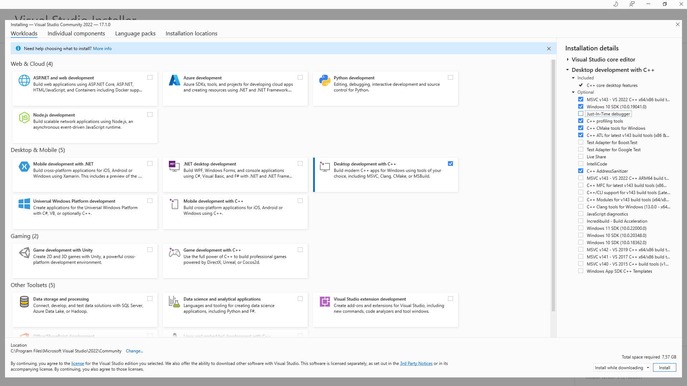

# Image Compressor

## Github

Lien Github: https://github.com/QuentinKlebaur/image_compressor

## Installations

### Visual Studio

Afin de compiler le projet, il faut une version récente de MSVC. Vous pourrez installer Visual Studio grâce à ce lien: https://visualstudio.microsoft.com/fr/downloads/

Appuyez sur le bouton **Téléchargement gratuit** sur cette page.
Lancez l'executable d'installation.

Visual Studio vous proposera les modules que vous voudrez installer. Choisissez **Desktop development with C++** et cochez options que dans la liste à droite de l'image ci-dessous.

Attendez ensuite que l'installation se termine.

### CMake

Pour installer CMake, je peux vous proposer cette vidéo tutoriel: https://www.youtube.com/watch?v=8_X5Iq9niDE&ab_channel=Aredhele

Pour résumer son contenu, il vous suffit d'aller sur ce lien:

https://cmake.org/download/

Sélectionnez ensuite le fichier **Windows x64 ZIP** (cmake-3.23.0-rc2-windows-x86_64.zip) de la rubrique **Binary distributions**.

Une fois téléchargé, il vous suffira de le décompresser, puis d'ajouter le chemin menant à l'exécutable de cmake se trouvant de la fichier **bin** du fichier fraîchement décompressé à votre variable d'environnement **Path** (*ex: C:\\cmake-3.23.0-rc2-windows-x86_64\\bin*).

Pour ajouter une variable d'environnement sur Windows, il faut:
- Aller dans le menu **Démarrer** de windows
- Écrire "variable", ce qui vous proposera un menu **Modifier les variables d'environnement système. Cliquez dessus.
- CLiquez sur le bouton **Variables d'environnement...**
- Dans la rubrique **Variables système**, trouvez et cliquez sur **Path**, puis sur le bouton **modifier...**.
- Cliquez sur **Nouveau** et collez le chemin menant à l'exécutable de CMake.
- Cliquez sur **Ok** pour chaque fenêtre qui s'est ouverte pour valider les modifications.

## Build

Pour build le projet, il suffit de lancer le script **build.bat** à la racine de ce dossier. Je recommande de le lancer dans un terminal afin de vérifier si tout s'est bien passé. Si tout à bien été installé au préalable, il ne devrait pas y avoir de problème de build.

## Exécution du projet

Tout comme pour le build, vous pourrez utiliser le script **execution.bat** pour lancez le projet.
Vous pourrez également modifier ce script avec n'importe quel éditeur de texte afin de modifier les arguments d'entrées du programme.

Voici comment se lance le programme:

*nom_executable*    *chemin_image*  *dossier_destination*   *algorithm* *calcul_distance*   *k|epsilon*

**Exemples**:
- *chemin_image* : folder\\image.png
- *dossier_destination* : folder\\output\\
- *algorithm* : kmeans | dbscan
- *calcul_distance* : euclidean | manhattan
- *k|epsilon* : 16 | 23.55

Il vous sera donc possible de chosir l'image que vous voulez compresser, le dossier où elle sera enregistrée, l'algorithme de compression, la fonction de calcul de distance entre 2 couleurs et l'argument de configuration de l'algorithme.

## Tips

Je vous recommande fortement d'utiliser la fonction de calcul *manhattan* car elle est bien plus rapide d'exécution que l'*euclidean*.

Lorsque le programme s'exécute, il ouvre un terminal montrant à quelle étape il est de la compression. À la fin de l'exécution, le temps d'exécution est également affiché.

Lorsqu'une image compressé est enregistré, elle est automatiquement nommée en fonction des arguments utilisés. Par exemple, si l'image d'origine se nomme **dog.png**, l'image créée par le programme pourrait sobrement s'intituler **dog_dbscan_euclidean_30.png**.

Si le programme est lancé deux fois avec les mêmes arguments, la première image créée ne sera pas écrasé par la seconde exécution, mais le programme créera deux images: **dog_dbscan_euclidean_30.png** et **dog_dbscan_euclidean_30 (1).png**.